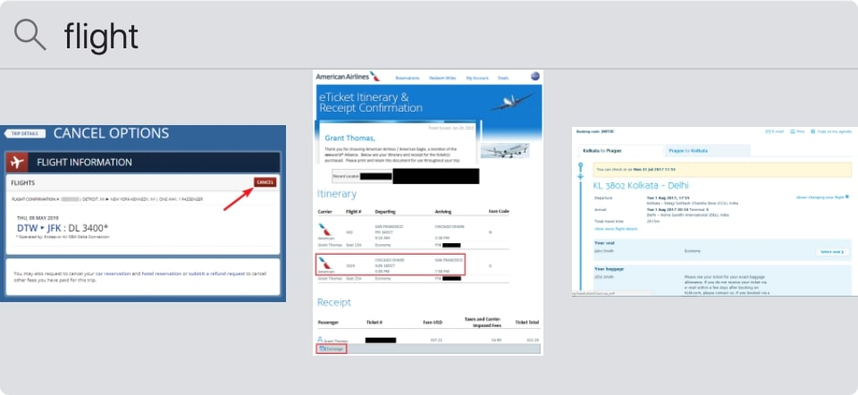

# Screenie Core

[Screenie](https://www.thnkdev.com/Screenie/) is a macOS screenshot manager to quickly access and search your screenshots. Screenie Core combines the OCR and indexing functionaliy powering the app. Text recognition is done using the [Vision](https://developer.apple.com/documentation/vision/vnrecognizetextrequest) framework. With some additional parsing to increase recall.



## Getting Started

The main interface to Screenie Core is the `Indexer` class. You provide the `Indexer` with a collection of `IndexItem`s. The items implement a single function:

```
public protocol IndexItem: Hashable {
  func getSearchableRepresentation(
    indexContext: IndexContext,
    tokenizer: NLTokenizer,
    progressHandler: @escaping (Double) -> Void,
    completion: @escaping (SearchableRepresentation) -> Void)
}
```

See [ScreenieCoreTests.swift](Tests/ScreenieCoreTests/ScreenieCoreTests.swift) for a simple example.

The index on it's own doesn't perform OCR, you can use `ImageFile`s `findText` function to determine which words you're intrested in.

```
let imageFile = MyConcreteImageFile()
imageFile.findText(progressHandler: { _ in }, completion: { wordProvider in
  print(wordProvider(2, 0.5))
})
```

### Prerequisites

Requires macOS 10.15+ or iOS 13+

### Installing

ScreenieCore uses [SPM](https://swift.org/package-manager/). To open, simply drag and drop Package.swift to xcode in the dock.

## License

This project is licensed under the MIT License - see the [LICENSE.md](LICENSE.md) file for details

